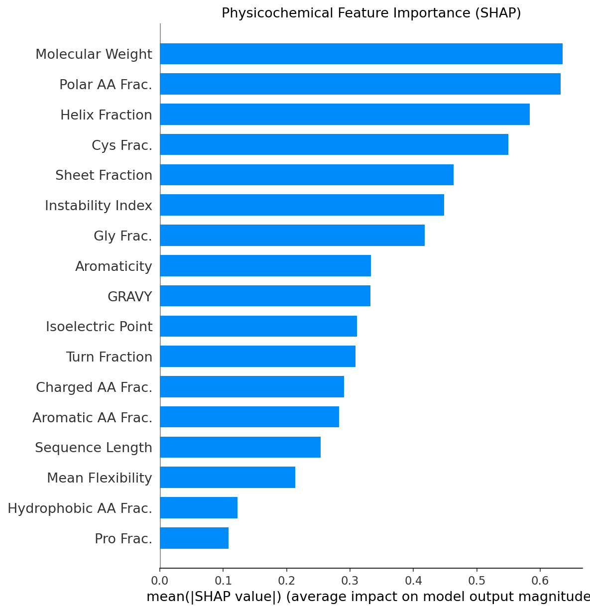
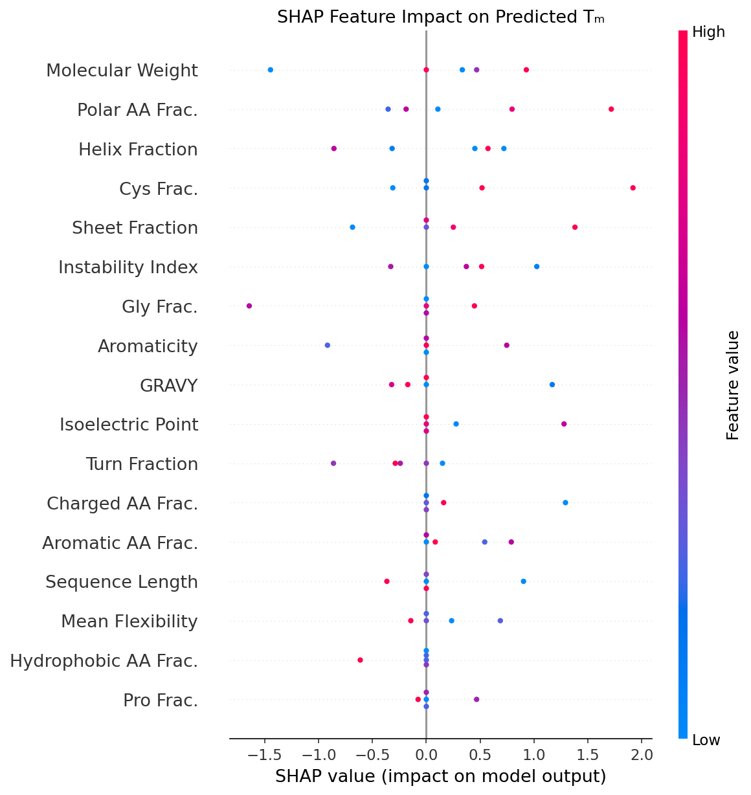

# NbBayesLM 🧬

**Bayesian Prediction of Nanobody Thermostability Using Protein Language Models**

[](https://www.frontiersin.org/journals/bioinformatics)
[](https://www.python.org/)
[](LICENSE)

> Predicting nanobody melting temperature (Tm) with calibrated uncertainty — enabling experimental prioritization and reducing wet-lab screening costs in biologics development.

---

## 📌 Overview

Nanobody thermostability is a critical property for biologics manufacturing, cold-chain resilience, and therapeutic viability. NbBayesLM is a **Bayesian Neural Network (BNN)** framework that fuses:

- **Protein Language Model embeddings** (ESM-2, AbLang) for rich sequence representations
- **Physicochemical features** (hydrophobicity, charge, cysteine frequency) as Bayesian priors

The result is accurate Tm prediction with **well-calibrated uncertainty estimates** — allowing researchers to rank candidates by both predicted stability and confidence before committing to expensive experiments.

---

## 📊 Performance

| Model | MAE (°C) | R² | Uncertainty |
|---|---|---|---|
| **NbBayesLM (ours)** | **1.89** | **0.67** | ✅ Calibrated |
| NanoMelt | 2.31 | 0.58 | ❌ None |
| Deterministic NN baseline | 2.14 | 0.61 | ❌ None |

Evaluated on 10,630 nanobody sequences via 5-fold cross-validation and external validation on 83 NanoMelt sequences.

---

## 🔍 Uncertainty Decomposition

NbBayesLM decomposes prediction uncertainty into two interpretable components:

**Epistemic Uncertainty** (Model Uncertainty)
- Arises from limited training data
- High for novel or out-of-distribution sequences
- Reducible with more data

**Aleatoric Uncertainty** (Data Noise)
- Arises from experimental variability (CD, DSF, DSC measurement inconsistencies)
- Irreducible — reflects inherent noise in the biological system

**Total Uncertainty = Epistemic + Aleatoric**

This decomposition allows users to distinguish whether uncertainty stems from model limitations or genuine experimental noise — a critical distinction for experimental prioritization.

---

## 🗂️ Repository Structure

```
NbBayesLM/
│
├── README.md
├── requirements.txt
├── LICENSE
│
├── src/
│   ├── model.py                  # Bayesian Neural Network architecture
│   ├── train.py                  # Training pipeline (5-fold CV)
│   ├── predict.py                # Inference and uncertainty estimation
│   ├── features.py               # Physicochemical feature extraction
│   ├── interpretability.py       # Attention & SHAP interpretability
│   └── utils.py                  # Helper functions
│
├── data/
│   ├── NB_bench_test_dataset.csv
│   ├── NanoMelt_83_external_dataset.csv
│   ├── NanoMelt_83_external_dataset.fasta
│   └── NanoMelt_Results_83.csv
│
├── models/                       # Pretrained weights (5-fold)
│   ├── bayesian_model_fold1.pt
│   ├── bayesian_model_fold2.pt
│   ├── bayesian_model_fold3.pt
│   ├── bayesian_model_fold4.pt
│   └── bayesian_model_fold5.pt
│
├── results/                      # Evaluation metrics per fold
│   ├── bayesian_metrics_fold1.txt
│   └── ...
│
└── figures/
    ├── shap_summary_bar.png
    └── shap_summary_beeswarm.png
```

---

## ⚙️ Installation

```bash
git clone https://github.com/FairuzShadmaniShishir/NbBayesLM.git
cd NbBayesLM
pip install -r requirements.txt
```

**Requirements:** Python 3.8+, PyTorch, ESM-2, scikit-learn, SHAP (see `requirements.txt` for full list)

---

## 🚀 Quick Start

**Train the model (5-fold cross-validation):**
```bash
python src/train.py --data data/NB_bench_test_dataset.csv --folds 5
```

**Run inference on new sequences:**
```bash
python src/predict.py --input your_sequences.fasta --model models/bayesian_model_fold1.pt
```

**Evaluate on external dataset:**
```bash
python src/predict.py --input data/NanoMelt_83_external_dataset.fasta --model models/bayesian_model_fold1.pt
```

---

## 🧠 Interpretability

NbBayesLM includes attention-based and SHAP-based interpretability to identify which sequence features and physicochemical properties drive thermostability predictions.




---

## 📄 Citation

If you use NbBayesLM in your research, please cite:

```bibtex
@article{shishir2026nbbayeslm,
  title     = {NbBayesLM: Bayesian Prediction of Nanobody Thermostability Using Protein Language Model},
  author    = {Fairuz Shadmani Shishir and Rokunuzjahan Rudro and Bishnu Sarker and Cuncong Zhong and Sumaiya Shomaji},
  journal   = {Frontiers in Bioinformatics},
  year      = {2026}
}
```

---

## 🔗 Related Work

- [MetaLLM](https://github.com/FairuzShadmaniShishir/A-Deep-Learning-Framework-for-Protein-to-Metal-Binding-Prediction-Using-Protein-Language-Models) — Protein metal binding site prediction · IEEE Trans. Comput. Biol. Bioinform., 2025
- [CIgFlow](#) — Antigen-specific antibody design via conditional flow matching · Under Review, IEEE TCBB 2026
- [GPCR-SLM](#) — Scalable GPCR family classification · Under Review, IEEE TCBB 2026

---

## 📬 Contact

**Fairuz Shadmani Shishir**
PhD Candidate, University of Kansas
✉️ shishir@ku.edu
🔗 [Google Scholar](#) · [LinkedIn](https://www.linkedin.com/in/fairuz-shadmani-shishir-558a13142/) · [GitHub](https://github.com/FairuzShadmaniShishir)
